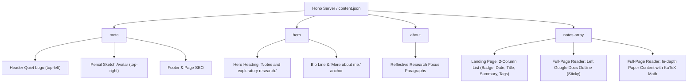

# API & JSON Schema Documentation for Academic Notebook Portfolio (Hono Backend)

This document specifies the exact JSON schemas, API endpoint contracts, and content mapping used by the minimal portfolio website and full-page Google Docs reader, powered by an ultra-lightweight **Hono** backend.

---

## 1. Quick Start (Hono Backend)

```bash
# Install minimal dependencies (only hono & @hono/node-server)
npm install

# Start production server (default port 3000)
npm start

# Or start in watch mode for development
npm run dev
```

The server serves:
- The static frontend portfolio at `http://localhost:3000/`
- Full REST API endpoints at `http://localhost:3000/api/*`

---

## 2. Architecture Overview & Content Placement



---

## 3. API Endpoints Contract

### 1. `GET /api/portfolio`
Returns the full portfolio payload (metadata, hero, about, and all full research papers).

#### Response: `200 OK`
```json
{
  "status": "success",
  "data": {
    "meta": {
      "authorName": "Karan",
      "logoText": "Karan",
      "avatarUrl": "avatar.jpg",
      "pageTitle": "Karan — Notes & Exploratory Research",
      "metaDescription": "Personal notebook and exploratory research on learning algorithms, AI for science, and quantum computing.",
      "copyrightYear": 2026,
      "socialLinks": [
        { "platform": "GitHub", "url": "https://github.com" },
        { "platform": "Twitter", "url": "https://twitter.com" },
        { "platform": "Email", "url": "mailto:karan@research.org" }
      ]
    },
    "hero": {
      "heading": "Notes and exploratory research.",
      "bioHighlight": "Karan",
      "bioIntro": "I think about learning algorithms, AI for science, and quantum computing.",
      "moreAboutText": "More about me.",
      "moreAboutAnchor": "#about"
    },
    "about": {
      "sectionLabel": "About & Focus",
      "paragraphs": [
        "I explore representations in neural systems, high-dimensional computing, and how algebraic mathematical structures translate into computational substrates.",
        "Currently spending time writing notes, building small exploratory models, and reading literature across machine learning theory, cognitive architectures, and physics-informed computational frameworks."
      ]
    },
    "notes": [
      {
        "id": "note-1",
        "slug": "bundling-binding-representation",
        "type": "ESSAY",
        "date": "2026-04-22",
        "formattedDate": "Apr 22, 2026",
        "readTime": "30 min",
        "tags": ["#hdc", "#interpretability", "#notes"],
        "title": "Bundling, Binding, And Other Things Your Brain Probably Does, Or Not",
        "summary": "An exploratory walk through the algebra of compositional representation.",
        "subtitle": "An exploratory walk through the algebra of compositional representation and vector symbolic architectures.",
        "sections": [
          {
            "id": "abstract",
            "title": "Abstract",
            "content": "<div class=\"p-4 sm:p-5 bg-neutral-50 border border-neutral-200/80 rounded-md text-[14px] leading-relaxed text-neutral-700 italic\"><strong>Abstract —</strong> ...</div>"
          },
          {
            "id": "sec-1",
            "title": "1. The Superposition Dilemma & Symbolic Graphs",
            "content": "<p>Classical symbolic AI represents complex compositions using discrete syntactic parse trees...</p>"
          }
        ]
      }
    ]
  }
}
```

---

### 2. `GET /api/notes`
Returns lightweight list for the landing page without full section bodies.

#### Response: `200 OK`
```json
{
  "status": "success",
  "count": 5,
  "data": [
    {
      "id": "note-1",
      "slug": "bundling-binding-representation",
      "type": "ESSAY",
      "date": "2026-04-22",
      "formattedDate": "Apr 22, 2026",
      "readTime": "30 min",
      "tags": ["#hdc", "#interpretability", "#notes"],
      "title": "Bundling, Binding, And Other Things Your Brain Probably Does, Or Not",
      "summary": "An exploratory walk through the algebra of compositional representation."
    }
  ]
}
```

---

### 3. `GET /api/notes/:id`
Returns the complete long-form paper with all sections for the Google Docs reader view (supports both `id` like `note-1` and `slug` like `bundling-binding-representation`).

#### Response: `200 OK`
```json
{
  "status": "success",
  "data": {
    "id": "note-1",
    "slug": "bundling-binding-representation",
    "type": "ESSAY",
    "date": "2026-04-22",
    "formattedDate": "Apr 22, 2026",
    "readTime": "30 min",
    "tags": ["#hdc", "#interpretability", "#notes"],
    "title": "Bundling, Binding, And Other Things Your Brain Probably Does, Or Not",
    "summary": "An exploratory walk through the algebra of compositional representation.",
    "subtitle": "An exploratory walk through the algebra of compositional representation and vector symbolic architectures.",
    "sections": [
      {
        "id": "abstract",
        "title": "Abstract",
        "content": "<div class=\"p-4 sm:p-5 bg-neutral-50 border border-neutral-200/80 rounded-md text-[14px] leading-relaxed text-neutral-700 italic\"><strong>Abstract —</strong> ...</div>"
      },
      {
        "id": "sec-1",
        "title": "1. The Superposition Dilemma & Symbolic Graphs",
        "content": "<p>...</p>"
      }
    ]
  }
}
```

---

### 4. Granular Section Endpoints

- `GET /api/meta`: Returns website branding, author, title, avatar URL, copyright.
- `GET /api/hero`: Returns hero heading, bio line, and anchor link.
- `GET /api/about`: Returns research focus paragraphs.
- `GET /api/schema`: Returns formal JSON Schema Draft 2020-12.
- `GET /health`: Health check (`{ "status": "ok", "service": "academic-portfolio-backend" }`).

---

## 4. Implementation Files

- [server.js](file:///Users/cv/Desktop/Portfolio/server.js): Hono server with CORS, logging, route handlers, and static asset serving.
- [package.json](file:///Users/cv/Desktop/Portfolio/package.json): Minimal dependency setup (`hono`, `@hono/node-server`).
- [content.json](file:///Users/cv/Desktop/Portfolio/content.json): Live data bundle.
- [schema.json](file:///Users/cv/Desktop/Portfolio/schema.json): Standard JSON Schema.
